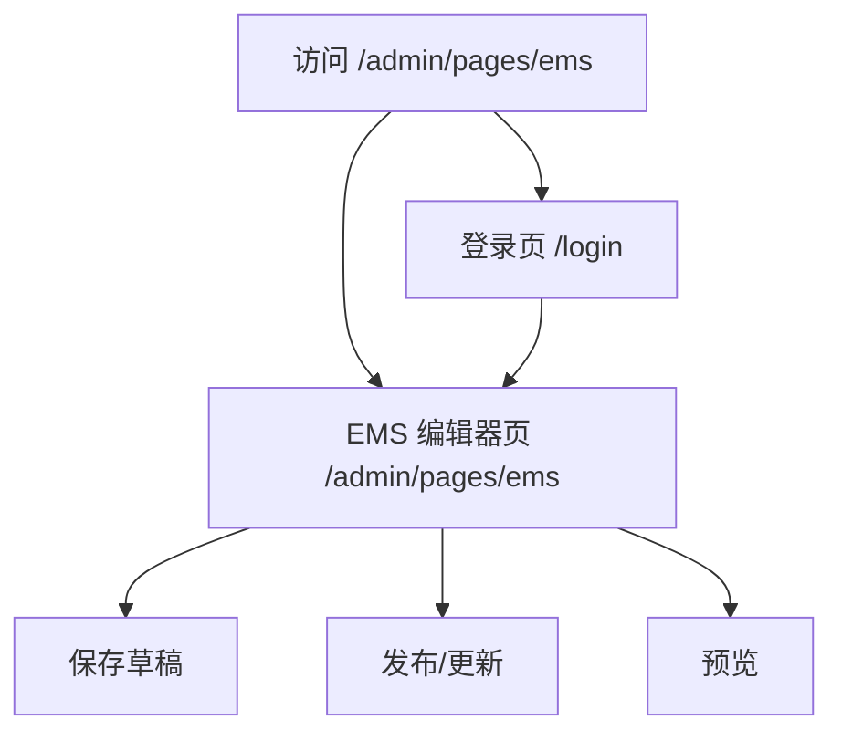

## 1. Product Overview
面向站点运营人员的 **/admin/pages/ems** 后台页面编辑器原型，用于编辑与发布“EMS 页面”内容。
布局与交互参考 WordPress：顶部标题+Slug、右侧发布栏、主区 Tabs + Accordion、SEO 独立卡片；**明确不做 pcb-assembly 相关内容与能力展示**。

## 2. Core Features

### 2.1 User Roles
| 角色 | 注册/登录方式 | 核心权限 |
|------|----------------|----------|
| 后台编辑人员（Admin/Editor） | 通过账号密码登录（Supabase Auth） | 登录后台；编辑 EMS 页面；保存草稿；发布/更新；编辑 SEO 信息 |

### 2.2 Feature Module
本原型最小可用需求包含以下页面：
1. **登录页**：账号密码登录、错误提示、登录后跳转。
2. **EMS 后台编辑器页（/admin/pages/ems）**：标题+Slug、内容编辑（Tabs + Accordion）、右侧发布栏、SEO 卡片、保存与发布。

### 2.3 Page Details
| Page Name | Module Name | Feature description |
|-----------|-------------|---------------------|
| 登录页 | 登录表单 | 输入邮箱/密码并提交登录；校验必填；展示错误；成功后跳转到 /admin/pages/ems |
| EMS 后台编辑器页 | 顶部信息栏（Title + Slug） | 编辑页面标题；自动生成 slug（可手动改写）；显示当前保存状态（未保存/已保存/保存中）；提供“预览”入口（仅前端预览，无需公开发布） |
| EMS 后台编辑器页 | 主区内容（Tabs） | 在同一页面内切换不同内容域（至少：内容、结构化模块）；切换不丢失未保存更改 |
| EMS 后台编辑器页 | 结构化模块（Accordion） | 以 Accordion 管理多个内容块：新增/删除/排序；每块包含块标题与内容输入；展开/收起编辑；用于表达 EMS 页面所需模块化内容 |
| EMS 后台编辑器页 | 右侧发布栏（Publish） | 展示状态（草稿/已发布）；提供保存草稿、发布/更新按钮；发布前校验必填（标题、slug）；发布成功提示 |
| EMS 后台编辑器页 | SEO 独立卡片（SEO） | 编辑 meta title、meta description、OG 标题/描述（可复用）、OG 图片（可选）；展示搜索结果片段预览（仅视觉预览） |
| EMS 后台编辑器页 | 权限与范围声明 | 在页面显著位置（如页脚/说明文案）明确：本编辑器仅用于 EMS 页面内容；**不包含 pcb-assembly 相关字段/模块** |

## 3. Core Process
- 后台编辑流程：你访问 /admin/pages/ems → 若未登录则跳转登录页 → 登录成功进入编辑器 → 编辑标题与 slug → 在主区通过 Tabs 编辑内容，并用 Accordion 管理模块化内容块 → 在右侧发布栏点击“保存草稿”或“发布/更新” → 保存成功后保持在当前页。

