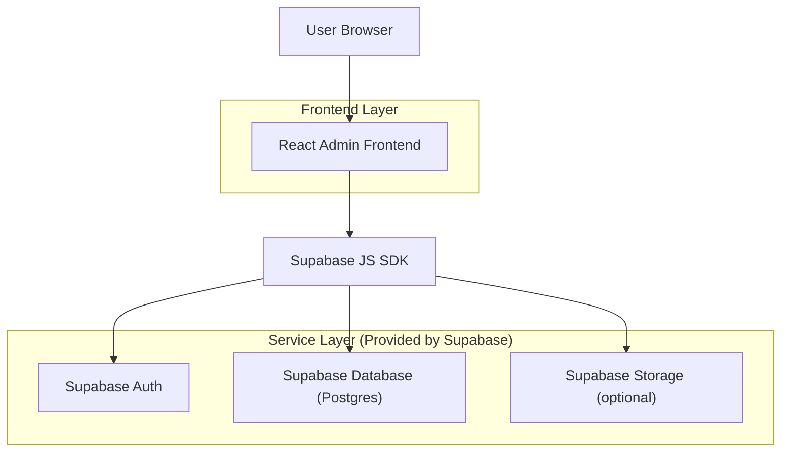
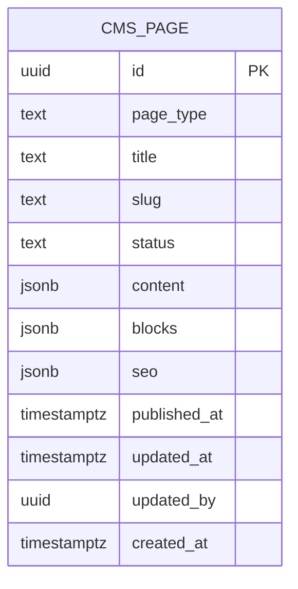

## 1.Architecture design


## 2.Technology Description
- Frontend: React@18 + TypeScript + vite + tailwindcss@3
- Backend: None（直接使用 Supabase）
- BaaS: Supabase（Auth + Postgres；Storage 用于 SEO/OG 图片可选）
- Editor: TipTap（或同类富文本编辑器），用于“内容”与 Accordion 内容块输入

## 3.Route definitions
| Route | Purpose |
|-------|---------|
| /login | 后台登录页（Supabase Auth 登录） |
| /admin/pages/ems | EMS 页面编辑器（标题/slug、Tabs+Accordion、发布栏、SEO 卡片） |

## 6.Data model(if applicable)

### 6.1 Data model definition


说明（原型最小字段）：
- page_type：固定为 "ems"（用于明确范围；不承载 pcb-assembly）
- content：主内容（富文本/结构化内容序列化）
- blocks：Accordion 模块数组（含顺序）
- seo：meta/OG 配置

### 6.2 Data Definition Language
CMS 页面表（cms_pages）
```sql
-- create table
create table if not exists cms_pages (
  id uuid primary key default gen_random_uuid(),
  page_type text not null check (page_type in ('ems')),
  title text not null,
  slug text not null,
  status text not null default 'draft' check (status in ('draft','published')),
  content jsonb not null default '{}'::jsonb,
  blocks jsonb not null default '[]'::jsonb,
  seo jsonb not null default '{}'::jsonb,
  published_at timestamptz null,
  updated_at timestamptz not null default now(),
  updated_by uuid null,
  created_at timestamptz not null default now()
);

-- unique slug per type
create unique index if not exists uq_cms_pages_type_slug on cms_pages(page_type, slug);

-- RLS
alter table cms_pages enable row level security;

-- prototype policy: only authenticated users can read/write
create policy "cms_pages_read_authenticated" on cms_pages
for select to authenticated
using (true);

create policy "cms_pages_write_authenticated" on cms_pages
for all to authenticated
using (true)
with check (true);

-- privileges (prototype)
grant select on cms_pages to authenticated;
grant insert, update, delete on cms_pages to authenticated;
```

可选：Storage（用于 OG 图片）
- bucket: seo-assets
- 约束：仅 authenticated 可读写（原型阶段不开放 anon）
