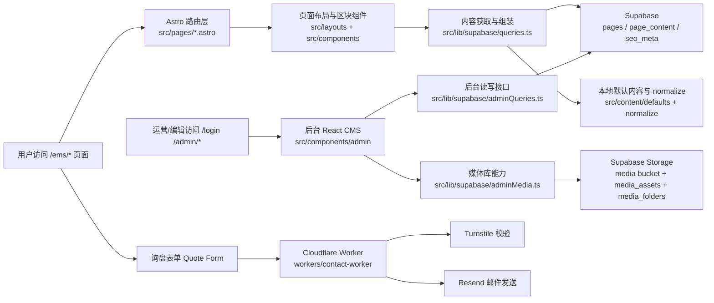
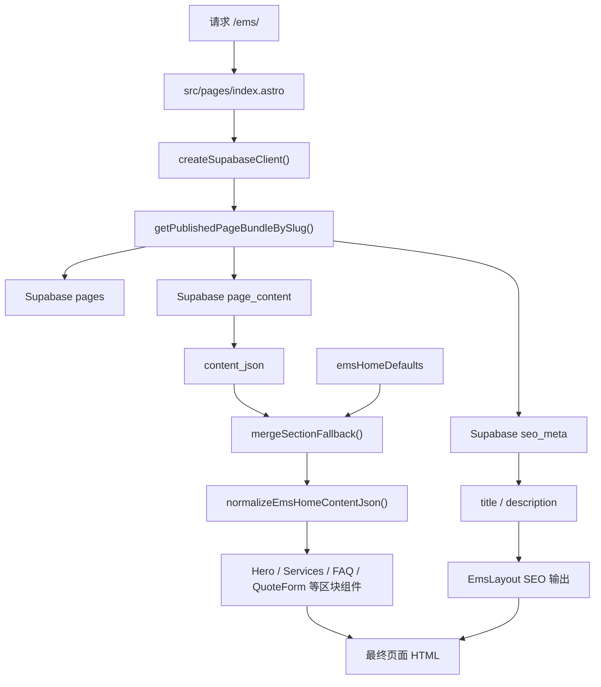
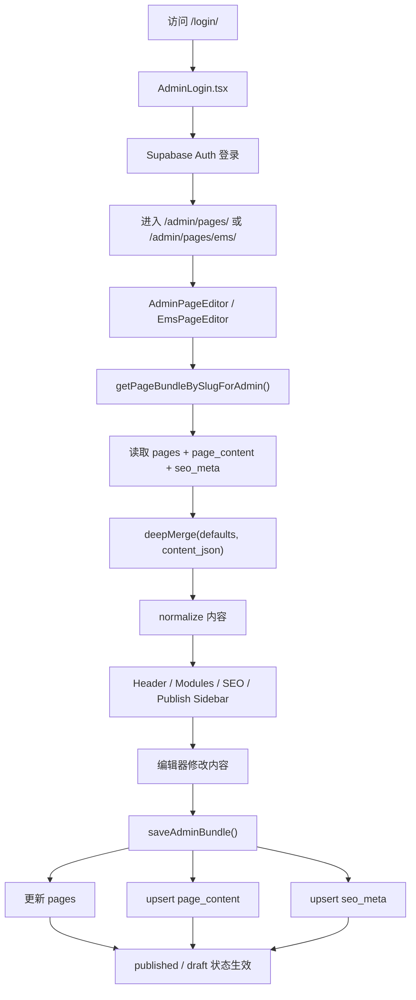
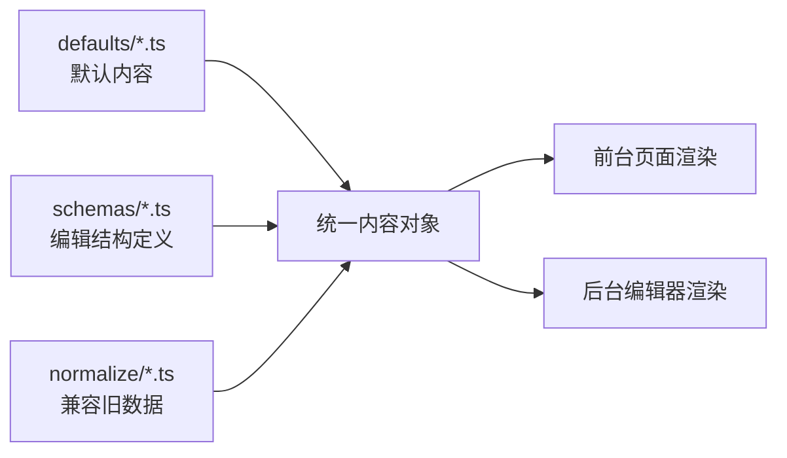
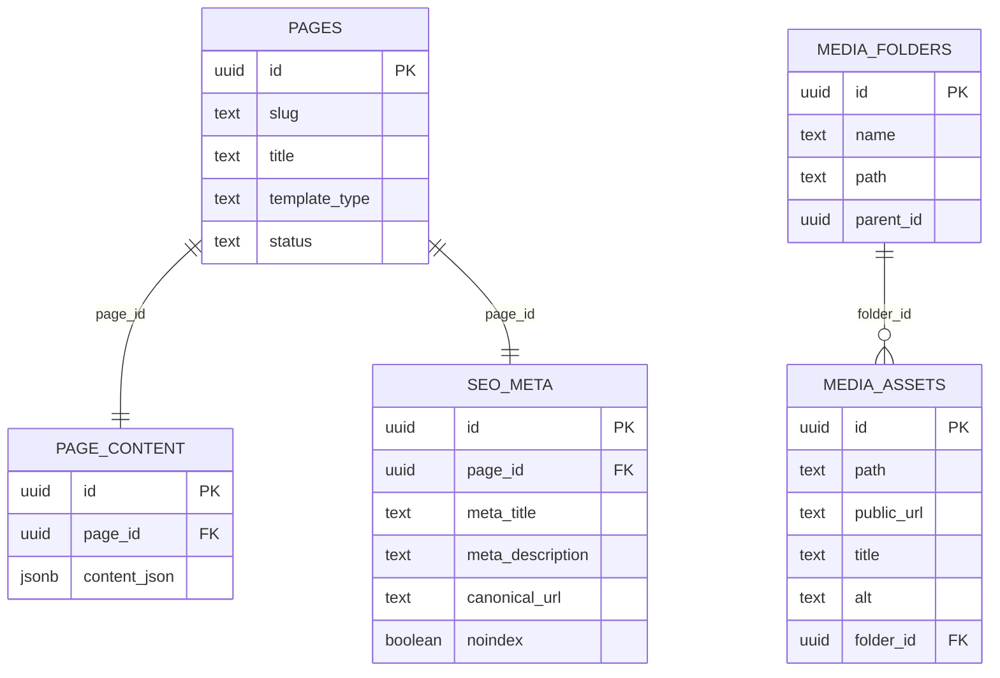
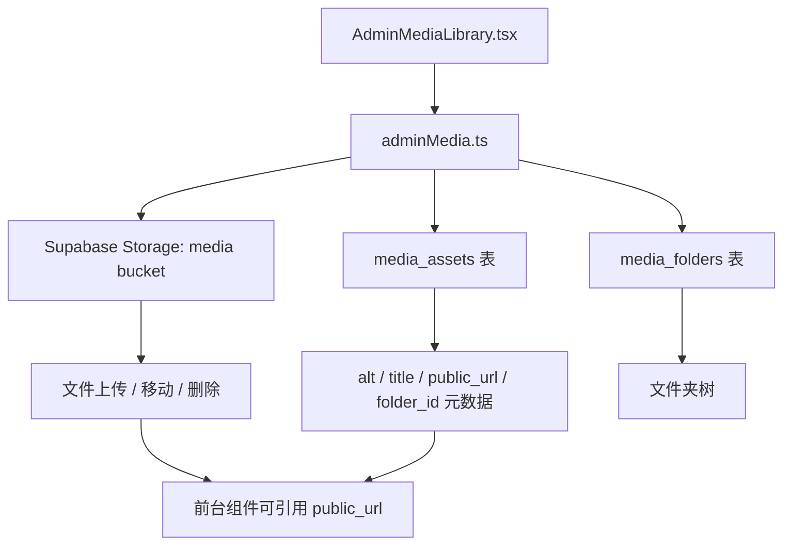
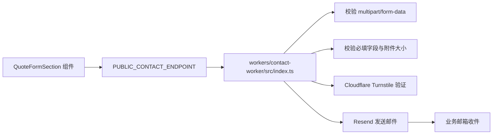

# PCB 项目代码地图

本文聚焦当前主应用 `[apps/ems-site](/Users/javen/Desktop/Javen Project/PCB/apps/ems-site)`，把前台页面、后台 CMS、Supabase 数据层、媒体库和联系表单 worker 之间的逻辑串起来，方便快速定位代码。

## 1. 项目全景

## 2. 目录地图

| 目录 | 作用 | 关键内容 |
| --- | --- | --- |
| `[apps/ems-site/src/pages](/Users/javen/Desktop/Javen Project/PCB/apps/ems-site/src/pages)` | Astro 路由入口 | 前台页面、登录页、后台页 |
| `[apps/ems-site/src/components](/Users/javen/Desktop/Javen Project/PCB/apps/ems-site/src/components)` | UI 组件层 | `common`、`ems`、`pcb-assembly`、`admin` 四类组件 |
| `[apps/ems-site/src/content](/Users/javen/Desktop/Javen Project/PCB/apps/ems-site/src/content)` | 内容模型层 | 默认值、schema、normalize 规则 |
| `[apps/ems-site/src/lib/supabase](/Users/javen/Desktop/Javen Project/PCB/apps/ems-site/src/lib/supabase)` | 数据访问层 | 前台查询、后台查询、媒体库、client 创建 |
| `[apps/ems-site/src/types](/Users/javen/Desktop/Javen Project/PCB/apps/ems-site/src/types)` | 类型定义 | 页面、SEO、各内容模块类型 |
| `[supabase/migrations](/Users/javen/Desktop/Javen Project/PCB/supabase/migrations)` | 数据库结构与演进 | 页面表、SEO 表、媒体库表、权限策略 |
| `[workers/contact-worker](/Users/javen/Desktop/Javen Project/PCB/workers/contact-worker)` | 表单后端 | Turnstile + Resend 邮件转发 |
| `[docs/BUG修复文档](/Users/javen/Desktop/Javen Project/PCB/docs/BUG修复文档)` | 历史问题记录 | 哪些模块高频出错、修复方式是什么 |

## 3. 前台渲染链路

以 `[src/pages/index.astro](/Users/javen/Desktop/Javen Project/PCB/apps/ems-site/src/pages/index.astro)` 为例，前台页面不是把内容硬编码在组件里，而是运行时把数据库内容和默认内容合并后再渲染。

### 前台核心职责拆分

- `[src/pages/*.astro](/Users/javen/Desktop/Javen Project/PCB/apps/ems-site/src/pages)`：负责“拿数据并拼页面”，不是做复杂业务逻辑。
- `[src/lib/supabase/queries.ts](/Users/javen/Desktop/Javen Project/PCB/apps/ems-site/src/lib/supabase/queries.ts)`：只关心已发布页面读取。
- `[src/content/defaults](/Users/javen/Desktop/Javen Project/PCB/apps/ems-site/src/content/defaults)`：定义每个页面/模块的兜底结构。
- `[src/lib/supabase/mappers.ts](/Users/javen/Desktop/Javen Project/PCB/apps/ems-site/src/lib/supabase/mappers.ts)`：通过 `mergeSectionFallback()` 做“缺字段补默认值”。
- `[src/content/normalize](/Users/javen/Desktop/Javen Project/PCB/apps/ems-site/src/content/normalize)`：修正历史数据形状不一致的问题，避免前端组件直接炸掉。
- `[src/components/common](/Users/javen/Desktop/Javen Project/PCB/apps/ems-site/src/components/common)` 与 `[src/components/ems](/Users/javen/Desktop/Javen Project/PCB/apps/ems-site/src/components/ems)`：真正把内容渲染成页面区块。

## 4. 后台 CMS 编辑链路

后台的目标是让编辑在浏览器里修改结构化 JSON，并同步更新页面基础信息、SEO 和发布状态。

### 后台关键文件

- `[src/components/admin/AdminLogin.tsx](/Users/javen/Desktop/Javen Project/PCB/apps/ems-site/src/components/admin/AdminLogin.tsx)`：基于 Supabase Auth 的登录入口。
- `[src/components/admin/AdminPageEditor.tsx](/Users/javen/Desktop/Javen Project/PCB/apps/ems-site/src/components/admin/AdminPageEditor.tsx)`：更通用的页面编辑器入口。
- `[src/components/admin/EmsPageEditor.tsx](/Users/javen/Desktop/Javen Project/PCB/apps/ems-site/src/components/admin/EmsPageEditor.tsx)`：EMS 首页专用编辑器，负责加载 `/ems/` 内容。
- `[src/components/admin/EmsEditorContentModules.tsx](/Users/javen/Desktop/Javen Project/PCB/apps/ems-site/src/components/admin/EmsEditorContentModules.tsx)`：把结构化 schema 渲染成可编辑模块。
- `[src/components/admin/EmsEditorSeoCard.tsx](/Users/javen/Desktop/Javen Project/PCB/apps/ems-site/src/components/admin/EmsEditorSeoCard.tsx)`：编辑 SEO 字段。
- `[src/components/admin/EmsEditorPublishSidebar.tsx](/Users/javen/Desktop/Javen Project/PCB/apps/ems-site/src/components/admin/EmsEditorPublishSidebar.tsx)`：处理草稿、发布、预览等动作。
- `[src/lib/supabase/adminQueries.ts](/Users/javen/Desktop/Javen Project/PCB/apps/ems-site/src/lib/supabase/adminQueries.ts)`：后台数据读写核心。

## 5. 内容模型层

这个项目内容管理的核心不是“一个组件绑一堆表单字段”，而是“先定义内容结构，再让前台和后台共享这个结构”。

### 这一层各文件的分工

- `[src/content/defaults/ems.ts](/Users/javen/Desktop/Javen Project/PCB/apps/ems-site/src/content/defaults/ems.ts)`、`pcb-assembly.ts`：定义页面初始结构与默认值。
- `[src/content/schemas/ems.ts](/Users/javen/Desktop/Javen Project/PCB/apps/ems-site/src/content/schemas/ems.ts)`、`pcb-assembly.ts`：定义后台编辑器要暴露哪些字段、字段类型是什么。
- `[src/content/normalize/ems.ts](/Users/javen/Desktop/Javen Project/PCB/apps/ems-site/src/content/normalize/ems.ts)`、`pcb-assembly.ts`：兼容历史 content_json 形状不一致的问题。

这层设计的意义是：

- 前台不需要关心数据库数据是否完整，只消费“已经 merge + normalize 后”的结构。
- 后台不直接写死表单，而是跟着 schema 走，扩展内容模块时更容易。
- 修历史脏数据时，优先在 normalize 层兜住，避免把防御逻辑散落到所有 UI 组件里。

## 6. 数据库与权限模型

当前站点的核心内容表比较简洁，页面实体和内容实体分离。

### 数据层规则

- `[supabase/migrations/phase4_schema.sql](/Users/javen/Desktop/Javen Project/PCB/supabase/migrations/phase4_schema.sql)`：定义 `pages`、`page_content`、`seo_meta`，并开启 RLS。
- 前台只能读 `published` 页面；这是公开访问的安全边界。
- 后台通过已登录 Supabase 用户读写完整页面数据。
- 后续媒体库相关迁移在 `[supabase/migrations/phase7_media_library.sql](/Users/javen/Desktop/Javen Project/PCB/supabase/migrations/phase7_media_library.sql)`、`phase7_media_folders.sql`、`phase9_media_assets_folder_id.sql`。

## 7. 媒体库链路

媒体库是后台 CMS 的配套能力，既依赖 Supabase Storage，也依赖数据库里的媒体元数据表。

### 这里要特别注意

- `[src/lib/supabase/adminMedia.ts](/Users/javen/Desktop/Javen Project/PCB/apps/ems-site/src/lib/supabase/adminMedia.ts)` 里对 `folder_id` 做了兼容分支，说明线上/本地可能存在不同阶段的表结构。
- 媒体库问题往往既可能是 Storage 问题，也可能是 `media_assets` 元数据同步问题，需要两边一起看。

## 8. 询盘表单链路

Quote Form 的前端展示在主站里，但提交逻辑被拆到了独立 worker。

### 这条链路的边界

- 前台站点负责表单 UI 和请求发起。
- Worker 负责反爬校验、安全限制、邮件通知。
- 这部分逻辑没有直接写进 Astro 站点里，所以排查表单问题时要同时看前端环境变量和 worker 环境变量。

## 9. 推荐阅读顺序

如果你接下来想继续深入，我建议按下面顺序读：

1. `[src/pages/index.astro](/Users/javen/Desktop/Javen Project/PCB/apps/ems-site/src/pages/index.astro)`：先理解前台是怎么拼出来的。
2. `[src/lib/supabase/queries.ts](/Users/javen/Desktop/Javen Project/PCB/apps/ems-site/src/lib/supabase/queries.ts)` + `[src/lib/supabase/mappers.ts](/Users/javen/Desktop/Javen Project/PCB/apps/ems-site/src/lib/supabase/mappers.ts)`：理解“读页面”链路。
3. `[src/content/defaults](/Users/javen/Desktop/Javen Project/PCB/apps/ems-site/src/content/defaults)` + `[src/content/normalize](/Users/javen/Desktop/Javen Project/PCB/apps/ems-site/src/content/normalize)`：理解内容模型。
4. `[src/components/admin/EmsPageEditor.tsx](/Users/javen/Desktop/Javen Project/PCB/apps/ems-site/src/components/admin/EmsPageEditor.tsx)` + `[src/lib/supabase/adminQueries.ts](/Users/javen/Desktop/Javen Project/PCB/apps/ems-site/src/lib/supabase/adminQueries.ts)`：理解后台编辑保存链路。
5. `[src/lib/supabase/adminMedia.ts](/Users/javen/Desktop/Javen Project/PCB/apps/ems-site/src/lib/supabase/adminMedia.ts)`：理解媒体库。
6. `[workers/contact-worker/src/index.ts](/Users/javen/Desktop/Javen Project/PCB/workers/contact-worker/src/index.ts)`：理解询盘表单后端。

## 10. 一句话总结

这个项目本质上是一个基于 Astro 的营销站点外壳，前台从 Supabase 拉取结构化页面内容，后台用 React CMS 编辑这些内容，再通过媒体库和 worker 补齐资源管理与表单投递能力。
