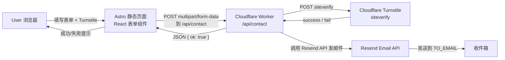
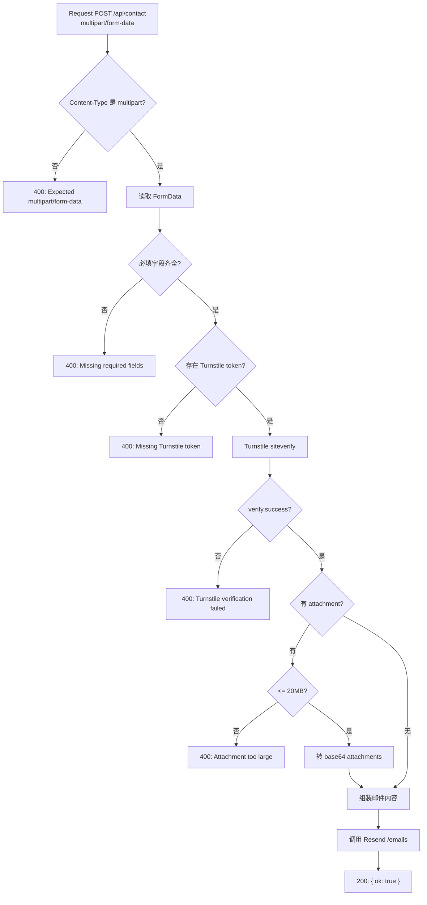

# 表单模块（Get Free Quote）实现说明

本文件整理 EMS 首页表单模块（Floating Center Card）的实现方式、目录结构、请求链路与注意事项。目标是：**保持 Astro 静态站不切 SSR**，把安全与邮件发送逻辑放到 **Cloudflare Worker** 中完成。<mccoremem id="03g053k76ky5emg8435w6yyuw" />

---

## 1. 目标与边界

- 目标：提供一个稳重、正统、强聚焦的报价表单；前端可交互（Turnstile、上传附件、提交态），后端只负责校验与发信。
- 不做：
  - 不建数据库存表单（初期）
  - 不做用户系统
  - 不做复杂风控/多步骤流程

---

## 2. 页面结构（Floating Center Card）

视觉结构遵循 `html设计稿/ems/form.html`：

- 上半区：浅色底（白/浅灰）
- 下半区：全宽暗调车间实拍图 + 深色遮罩
- 中间：白色表单卡片跨越分界线（强阴影 + 圆角）
- 表单布局：2 列网格（Name/Company；Email/Phone），Message 单列，Attachment 拖拽区，底部提交按钮

---

## 3. 数据与组件结构

### 3.1 内容来源（mock data）

表单文案与占位符不写死在组件中，放在 defaults 中：

- [ems.ts (defaults)](file:///Users/javen/Desktop/Javen%20Project/PCB/apps/ems-site/src/content/defaults/ems.ts)
  - `quote_form.title`
  - `quote_form.description`
  - `quote_form.background_image_url`
  - `quote_form.*_field.label/placeholder/required`
  - `quote_form.upload.*`
  - `quote_form.submit_label`

### 3.2 前端组件

- React 组件（UI + 提交 + Turnstile 脚本加载 + 附件选择显示）：  
  [QuoteFormSection.tsx](file:///Users/javen/Desktop/Javen%20Project/PCB/apps/ems-site/src/components/ems/QuoteFormSection.tsx)
- Astro 包装（`client:load`）：  
  [QuoteFormSection.astro](file:///Users/javen/Desktop/Javen%20Project/PCB/apps/ems-site/src/components/ems/QuoteFormSection.astro)
- 首页组合接入（只负责组合模块）：  
  [index.astro](file:///Users/javen/Desktop/Javen%20Project/PCB/apps/ems-site/src/pages/index.astro)

### 3.3 环境变量（前端）

前端只读 public 级别的配置：

- [env/index.ts](file:///Users/javen/Desktop/Javen%20Project/PCB/apps/ems-site/src/lib/env/index.ts)
  - `PUBLIC_CONTACT_ENDPOINT`：表单提交地址（默认 `/api/contact`）
  - `PUBLIC_TURNSTILE_SITE_KEY`：Turnstile 站点 key（存在则渲染 Turnstile widget）

---

## 4. 端到端流程（推荐部署形态）

### 4.1 总体链路图

关键点：

- Astro 继续保持静态构建（性能与部署简单）
- `/api/contact` 由 Cloudflare Worker 承担（安全逻辑集中）

---

## 5. Worker（/api/contact）职责与实现

Worker 放在仓库根的独立目录中（与 Astro app 解耦）：

- Worker 入口： [index.ts](file:///Users/javen/Desktop/Javen%20Project/PCB/workers/contact-worker/src/index.ts)
- Wrangler 配置： [wrangler.toml](file:///Users/javen/Desktop/Javen%20Project/PCB/workers/contact-worker/wrangler.toml)

### 5.1 Worker 内部流程图

### 5.2 Worker 环境变量（私密）

这些变量必须在 Worker 环境中配置（不进入前端，不写进 git）：

- `TURNSTILE_SECRET_KEY`：Turnstile secret
- `RESEND_API_KEY`：Resend API key
- `FROM_EMAIL`：发件人（建议配置为你域名下可用的发件地址）
- `TO_EMAIL`：收件人（你的邮箱）
- `ALLOWED_ORIGIN`：允许的跨域 Origin（默认写了 `https://rapiddirect.com`，本地开发可临时改）

---

## 6. 与页面 base=/ems 的关系（路径策略）

- 前端不要手写 `/ems/...` 到内容里
- `PUBLIC_CONTACT_ENDPOINT` 建议配置成绝对或同源路径，例如：
  - 生产：`https://rapiddirect.com/api/contact`
  - 本地：`http://localhost:8787/api/contact`（worker dev）
- 前端静态资源路径继续走 `getAssetPath('/images/...')` 统一加 base，避免出现 `/ems/ems/...`

---

## 7. 注意点（上线前必读）

### 7.1 Turnstile

- Turnstile widget 会在表单内生成字段 `cf-turnstile-response`；Worker 已按这个字段读取 token。
- 本地/生产环境需要不同的 site key/secret key（按 Turnstile 控制台配置）。

### 7.2 CORS 与同源

- 最稳的方案：Worker 绑定到同域 `rapiddirect.com/api/contact`（同源就不需要额外 CORS 复杂度）。
- 如果是跨域调用，需要确保：
  - Worker 返回 `access-control-allow-origin`
  - 前端 endpoint 使用正确域名

### 7.3 附件

- 当前 Worker 限制：最大 20MB（与 UI 文案一致）
- 注意 Resend 附件大小/数量限制（上线前按 Resend 文档确认）

### 7.4 邮件内容安全

- Worker 对所有用户输入在进入邮件 HTML 之前统一做 `escapeHtml()`，避免 HTML 注入风险。
- 字段长度限制（Worker 强制）：
  - `name <= 100`
  - `company <= 150`
  - `email <= 150`
  - `phone <= 50`
  - `message <= 5000`
- 附件文件名会去除控制字符并截断长度，避免异常内容影响邮件链路。

### 7.5 反滥用（建议后续加）

- 基于 `cf-connecting-ip` 做简单 rate limit（Worker KV / Durable Object）
- 记录失败的 Turnstile 错误码便于排查（但不要记录敏感字段）

---

## 8. 本地验证清单

- 前端：
  - 表单 UI 是否按 Floating Card 分层显示（上浅下深 + 悬浮卡）
  - focus 状态是否变为品牌橙色边框（平滑过渡）
  - 上传区 hover 是否变为橙色虚线边框风格
  - Turnstile widget 是否出现（设置 `PUBLIC_TURNSTILE_SITE_KEY` 后）
- Worker：
  - 缺字段是否返回 400（并且前端提示 error）
  - Turnstile 失败是否返回 400
  - 成功是否触发 Resend 发信并返回 `{ ok: true }`
