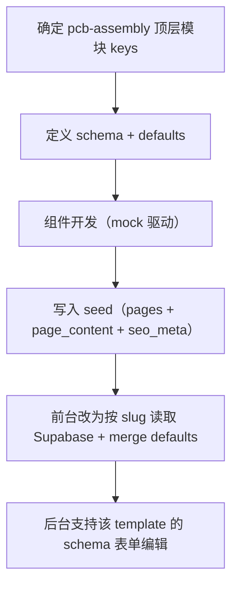

这份文档用于固化我们当前在 EMS 子站的页面开发顺序：**先 schema/模块，再前端渲染，再接 Supabase，最后补后台编辑**。核心目标是避免一开始就被“后台字段/表单复杂度”拖慢，同时保证最终能形成“后台 → Supabase → 前台”的闭环。

---

# 1) 一句话路线（MVP）

```text
字段结构（schema）确定
→ defaults/mock 驱动前端完成页面
→ Supabase seed + 前台按 slug 动态渲染闭环
→ 后台 schema 表单接入（可编辑并保存）
```

---

# 2) 标准流程图（建议所有服务页按此复制）

```mermaid
graph LR
  Start(("Start"))
  DefineModules["1. 定义页面顶层模块 keys<br/>例如 hero / sections / faq ..."]
  DefineSchema["2. 定义 schema（字段结构）<br/>字段命名稳定、可扩展"]
  Defaults["3. 写 defaults/mock<br/>用于组件开发与 fallback"]
  BuildUI["4. 开发前端组件（Astro/React）<br/>页面组合模块"]
  PreviewMock["5. 预览验证（mock 驱动）<br/>先把视觉与交互跑通"]
  SeedDB["6. Supabase seed<br/>pages + page_content + seo_meta"]
  ReadDB["7. 前台按 slug 读取 published bundle<br/>merge defaults + content_json"]
  VerifyDB["8. 验收：改 DB 字段 → 刷新页面变化"]
  AdminUI["9. 后台编辑器 UI（WP 心智模型）<br/>Tabs/Accordion/Repeater"]
  AdminRead["10. 后台读取并填充表单<br/>按 schema 渲染字段"]
  AdminSave["11. 保存回 Supabase（三表）"]
  VerifyLoop["12. 验收：后台改字段 → 保存 → 刷新前台变化"]
  Done(("Done"))

  Start --> DefineModules --> DefineSchema --> Defaults --> BuildUI --> PreviewMock
  PreviewMock --> SeedDB --> ReadDB --> VerifyDB --> AdminUI --> AdminRead --> AdminSave --> VerifyLoop --> Done
```



---

# 3) 为什么 pcb-assembly.astro 里会暂时写 `const hero = {...}`？

以 [index.astro](file:///Users/javen/Desktop/Javen%20Project/PCB/apps/ems-site/src/pages/index.astro) 对照：

- `index.astro` 已经进入“动态渲染闭环”：按 `slug = Astro.url.pathname` 从 Supabase 拉取 `content_json`，再 `merge defaults` 渲染。
- `pcb-assembly.astro` 目前处于“mock 驱动预览”阶段：为了快速验证 Hero 组件效果，先把 hero 数据写在页面里做临时 mock。

这段 mock 的正确归宿不是长期写在 `.astro` 页面里，而是迁移为：

```text
schema：src/content/schemas/<page>.ts
defaults：src/content/defaults/<page>.ts
DB：page_content.content_json
```

页面 `.astro` 最终只负责：

```text
读取 DB（如果有）→ merge defaults → 渲染模块
```

---

# 4) 当前项目的“已验证路径”（EMS Home）


---

# 5) PCB Assembly 下一步怎么做（从现在开始）



建议执行顺序（MVP）：先把 A~E 做完（确保服务页“数据库驱动渲染闭环”成立），再做 F（编辑器体验逐步补齐）。
